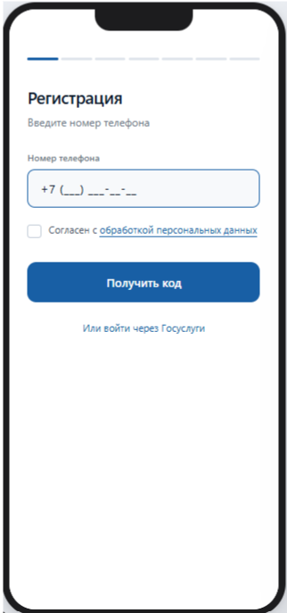
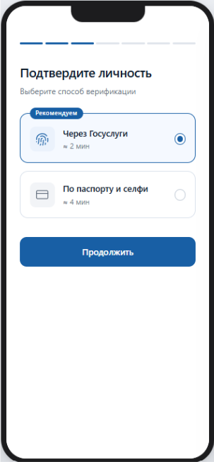
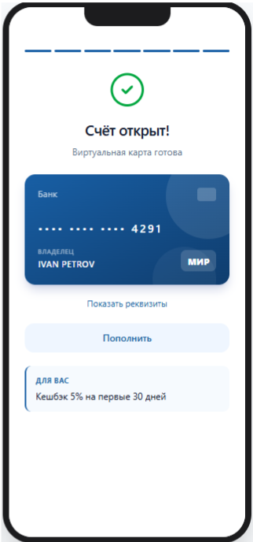

# Прототипы экранов - Цифровой онбординг

## Что это
Прототипы ключевых экранов мобильного приложения для сценария цифрового онбординга, разработанные в Figma по итогам [BRD](../BRD/BRD.md#17-прототипы-ключевых-экранов) и [Use Case диаграммы](../Use%20Case).

## Экраны

### Экран 1. Старт регистрации

Клиент вводит номер телефона и даёт согласие на обработку персональных данных для получения OTP-кода. Есть альтернативный вход через Госуслуги.

### Экран 2. Выбор способа верификации

Клиент выбирает канал идентификации: через Госуслуги  или по паспорту и селфи.

### Экран 3. Результат: счёт открыт

Финальный экран с подтверждением открытия счёта, реквизитами виртуальной карты «Мир» и персональным предложением по кешбэку.

## Инструменты
Figma

